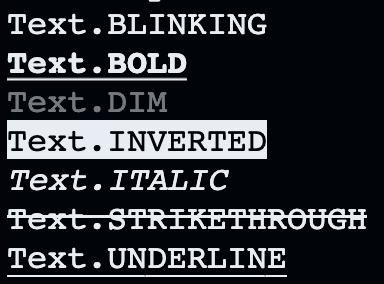
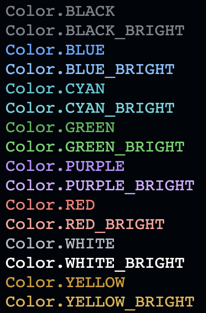
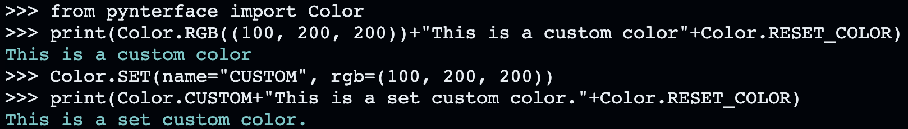
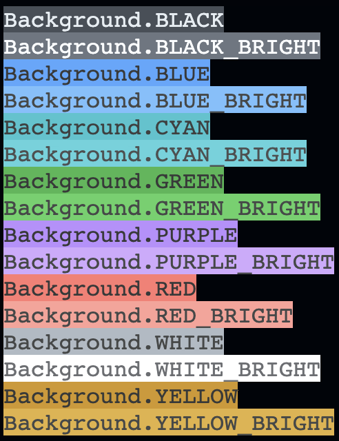
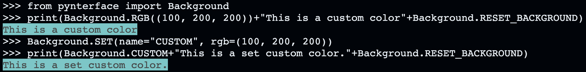

Documentation
#############

Here is the documentation for Pynterface!

Text Styling and Coloring
+++++++++++++++++++++++++

This is simply an alternative to `colorama <https://github.com/tartley/colorama>`, which I attempted to replicate, for fun, with this part of the package! It includes the additional ability to set custom RGB values, or custom colors with custom RGB values.

You can import this module using:

.. code:: python

    import pynterface.style

    # import individual classes
    from pynterface.style import Color, Background, Text 

For a quick demonstration of the different presets supported, you can call the following:

.. code:: python

    from pynterface.style import demo
    demo()  # prints presets and the ways to call them

Preset Options
--------------

For the :code:`Text` class, which manages text styles, here are the preset values and their corresponding ANSI codes:

.. code:: python

    RESET_ALL =     "\033[0m"
    RESET_STYLE =   "\033[22m"

    BOLD =          "\033[1m"
    DIM =           "\033[2m"
    ITALIC =        "\033[3m"
    UNDERLINE =     "\033[4m"
    BLINKING =      "\033[5m"
    INVERTED =      "\033[7m"
    STRIKETHROUGH = "\033[9m"

    HIDE_CURSOR =   "\033[?25l"
    SHOW_CURSOR =   "\033[?25h"

For the :code:`Color` class, which manages the color of text, here are the preset values and their codes:

.. code:: python

    RESET_COLOR =   "\033[39m"
    RESET_ALL =     "\033[0m"

    BLACK =     "\033[30m"
    RED =       "\033[31m"
    GREEN =     "\033[32m"
    YELLOW =    "\033[33m"
    BLUE =      "\033[34m"
    PURPLE =    "\033[35m"
    CYAN =      "\033[36m"
    WHITE =     "\033[37m"

    BLACK_BRIGHT =     "\033[90m"
    RED_BRIGHT =       "\033[91m"
    GREEN_BRIGHT =     "\033[92m"
    YELLOW_BRIGHT =    "\033[93m"
    BLUE_BRIGHT =      "\033[94m"
    PURPLE_BRIGHT =    "\033[95m"
    CYAN_BRIGHT =      "\033[96m"
    WHITE_BRIGHT =     "\033[97m"

For the :code:`Background` class, which manages the background of the text, here are the supported presets and their codes:

.. code:: python

    RESET_BACKGROUND =  "\033[49m"
    RESET_ALL =         "\033[0m"

    BLACK =     "\033[40m"
    RED =       "\033[41m"
    GREEN =     "\033[42m"
    YELLOW =    "\033[43m"
    BLUE =      "\033[44m"
    PURPLE =    "\033[45m"
    CYAN =      "\033[46m"
    WHITE =     "\033[47m"

    BLACK_BRIGHT =     "\033[100m"
    RED_BRIGHT =       "\033[101m"
    GREEN_BRIGHT =     "\033[102m"
    YELLOW_BRIGHT =    "\033[103m"
    BLUE_BRIGHT =      "\033[104m"
    PURPLE_BRIGHT =    "\033[105m"
    CYAN_BRIGHT =      "\033[106m"
    WHITE_BRIGHT =     "\033[107m"

Text Styles
-----------

Here are what the different text styles look like, and how you call them:

The :code:`Text.BLINKING`, which cannot be displayed in an image, produces blinking text.

You can also move the cursor up, down, left, and right, as follows:

.. code:: python

    Text.MOVE_CURSOR_UP(lines: int = 1)
    Text.MOVE_CURSOR_DOWN(lines: int = 1)
    Text.MOVE_CURSOR_LEFT(cols: int = 1)
    Text.MOVE_CURSOR_RIGHT(cols: int = 1)

Colors
------

Here are what the different colors look like and how you call them:

You can also call a custom RGB color, in the following format:

.. code:: python

    Color.RGB(rgb: tuple[int, int, int])

Or, you can set a color and call it later on,

.. code:: python

    Color.SET(name: str, rgb: tuple[int, int, int])

Here is an example:

    
Backgrounds
-----------

Here are what the different background colors are, and how you call them:

You can also call a custom RGB background, in the following format:

.. code:: python

    Background.RGB(rgb: tuple[int, int, int])

Or, you can set a color and call it later on,

.. code:: python

    Background.SET(name: str, rgb: tuple[int, int, int])

Here is an example:

